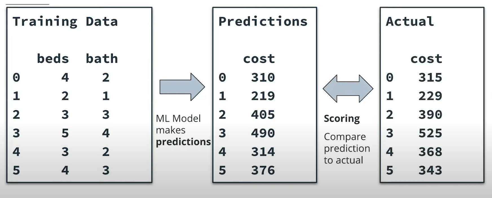

# Model Scoring and Model Drift


It's common to score models before deployment, when you're doing model selection. But you also need to do model scoring after deployment, to ensure that nothing has caused your model's performance to get worse.

In this lesson, we'll cover all of the following topics:

- **Automatic scoring**: reading saved models, making predictions, and comparing predictions to actual values - all automatically
- **Record keeping**: generating and saving records of model performance
- **Model drift**: how to measure and reason about changing model performance over time
- **Hypothesis testing**: using tools from statistics to compare the performance of different models


## Developing Your Intuition About Model Scoring

In this lesson, we'll talk about how to measure your model's performance. We'll also cover an important topic called model drift. Model drift is a term that refers to the degradation or decrease in a model's performance over time. It's important to check the performance of your model frequently to ensure that its performance remains high and model drift doesn't occur.



### Model Drift

Model drift will be an important topic in this lesson. You can see a diagram illustrating the idea of model drift below.


We train ML models to make sure they're as accurate as possible. But usually, model performance gets worse as models get older. There are a few things that can cause model performance to decrease over time:

- **Changes in the target variable**: in the example illustrated above, you can see a hypothetical ML model predicting house prices. When prices change, as they do almost constantly, a previously trained model will become less accurate, and obsolete.
- **Changes in the predictor variable**: if the model was trained to predict prices of houses with 2 or 3 bedrooms, but builders start to build houses with 4 or 5 bedrooms, it's possible that the model will perform worse because the predictor variable is outside the range where the model was trained.
- **Changes in the relationship between predictor and target**: many factors, such as utility prices, changing tastes, and new technology, can cause the relationship between predictors and targets to change, which can make models perform worse.

The world is always changing. Changes in the world can cause models to perform worse over time - in other words, it can cause models to drift. You need to constantly check for model drift, and retrain and re-deploy your models whenever drift occurs.

## Model Scoring

Model scoring is a straightforward idea: we have to compare predictions to actual values. The difference between predicted and actual values is the model's score.


The diagram below illustrates the model scoring process:


Diagram of the model scoring process: regularly read in fresh data, make predictions with a deployed model, and compare predicted values to actual values

Model scoring should happen at regular intervals. You should read fresh data, make predictions with a deployed model, and measure the model's errors by comparing predicted and actual values.

If your model begins to perform worse than it had before, then you're a victim of model drift. When model drift occurs, you need to retrain and re-deploy your model, as you did in the previous lesson.

### Demo: Model Scoring

You can start the demo by importing some relevant modules:

```
import pandas as pd
import pickle
from sklearn import metrics
from sklearn.metrics import f1_score
```

Next, you can open a deployed model:


```
with open('samplemodel.pkl', 'rb') as file:
    model = pickle.load(file)
```

After that, open your data and reshape it so you can make predictions with it:

```
testdata = pd.read_csv('testdata.csv')

X = testdata[['col1','col2']].values.reshape(-1,2)
y = testdata['col3'].values.reshape(-1,1)
```

Make predictions with your model and your data:


```
predicted = model.predict(X)
```

Compare predicted values and actual values. In this case, we calculate an F1 score: a useful metric for classification accuracy:

```
f1score = metrics.f1_score(predicted,y)
print(f1score)
```

