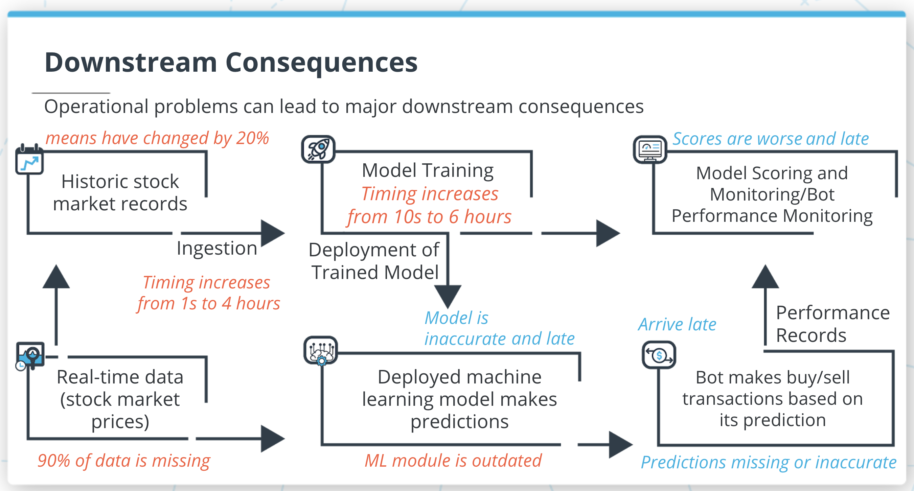

# Diagnosing and Fixing Operational Problems

Welcome to our lesson about diagnosing and fixing operational problems. Learning to diagnose and fix problems is very important in every ML project, since operational issues are nearly inevitable and they can derail even the best projects.

In this project, we'll discuss all of the following topics:

- **Process timing**: how to measure the timing of your project's ML processes
- **Integrity and stability**: how to diagnose integrity and stability issues in data
- **Dependencies**: understanding the third-party modules your code depends on
- **Data imputation**: an important method for resolving data integrity issues

By learning all of this, you'll gain important skills that will help you manage your ML projects and ensure they succeed.

---

In the diagram below, you can see an example machine learning project. However, pay special attention to the colored text, which indicates some potential operational problems that might happen to your project, and the consequences of those problems:

A diagram of a hypothetical ML project, with potential problems and consequences highighted

The following are operational issues that we'll discuss in this lesson:

- **Missing data**: when you ingest new data, you may find that some entries are missing. Missing data can cause your model to make inaccurate predictions.
- **Unstable data**: you may find that the data is not stable, that its values and means have changed substantially. Unstable data can also lead to inaccurate predictions.
- **Timing problems**: some parts of your project may suddenly have delays and timing problems. This can cause your predictions to arrive late or not arrive at all.
- **Dependency issues**: some modules that your code depends on may be outdated or buggy. This can cause your model to make inaccurate or useless predictions.

All of these problems are serious, and it's important to understand them and be able to diagnose and fix them.

