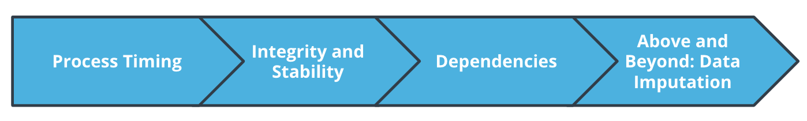

# Diagnosing and Fixing Operational Problems



Welcome to our lesson about diagnosing and fixing operational problems. Learning to diagnose and fix problems is very important in every ML project, since operational issues are nearly inevitable and they can derail even the best projects.

In this project, we'll discuss all of the following topics:

- **Process timing**: how to measure the timing of your project's ML processes
- **Integrity and stability**: how to diagnose integrity and stability issues in data
- **Dependencies**: understanding the third-party modules your code depends on
- **Data imputation**: an important method for resolving data integrity issues

By learning all of this, you'll gain important skills that will help you manage your ML projects and ensure they succeed.

---

In the diagram below, you can see an example machine learning project. However, pay special attention to the colored text, which indicates some potential operational problems that might happen to your project, and the consequences of those problems:


A diagram of a hypothetical ML project, with potential problems and consequences highighted

The following are operational issues that we'll discuss in this lesson:

- **Missing data**: when you ingest new data, you may find that some entries are missing. Missing data can cause your model to make inaccurate predictions.
- **Unstable data**: you may find that the data is not stable, that its values and means have changed substantially. Unstable data can also lead to inaccurate predictions.
- **Timing problems**: some parts of your project may suddenly have delays and timing problems. This can cause your predictions to arrive late or not arrive at all.
- **Dependency issues**: some modules that your code depends on may be outdated or buggy. This can cause your model to make inaccurate or useless predictions.

All of these problems are serious, and it's important to understand them and be able to diagnose and fix them.


## Timing ML Processes

Timing a process in Python follows the same logic as timing a process in the real world:

- Start a timer or stopwatch.
- At the moment when the timer starts, or as soon as possible afterward, begin the process you want to time.
- The process that you're timing ends.
- At the moment when the process ends, or as soon as possible afterward, stop the timer or stopwatch.

We can use the `timeit` module to check process timings in Python. We import it just like any other module:

```import timeit```

We can use the default_timer() as our "stopwatch":

`starttime = timeit.default_timer()`

Then, we run a process in Python:

`#[code for any process you want to time]`

Finally, we stop our "stopwatch," and calculate the difference between the starting time and the ending time:

`timing=timeit.default_timer() - starttime`


### Demo: Timing ML Processes

We start the demo by creating a file called `addnumbers.py`. This file contains a simple script. The purpose of this script is to add all the numbers between 1 and 10000. We don't care much what the final sum is - we're only using this script because we want to time how long it takes.

```python
##instantiating a variable that will store your final answer
finalanswer=0

##create a loop that iterates over all the numbers we're interested in, 
##and adds each of them to the final answer
for i in range(10000):
    finalanswer=finalanswer+i

##you can print the final answer
print(finalanswer)
```


Next, you can create a file called `timingdemo.py`. This file will time how long it takes to run `addnumbers.py`.

You can start your `timingdemo.py` file by importing the needed modules:

```python
import timeit
import os
```

Then, you need to start your timer or "stopwatch":

```python
starttime = timeit.default_timer()
```

Immediately after starting your stopwatch, you can run the addnumbers.py process:

```python
os.system('python3 addnumbers.py')`
```

Immediately after running the process, you can stop the timer and calculate how long it took the process to run:

```python
timing=timeit.default_timer() - starttime
```

You can print the total time the process took:

```python
print(timing)
```

Finally, you can create a Python list that will contain your timing result:

```python
final_output=[]
```

Append the timing result to the list, and print out the final result:

```python
final_output.append(timing)
print(final_output)
```


