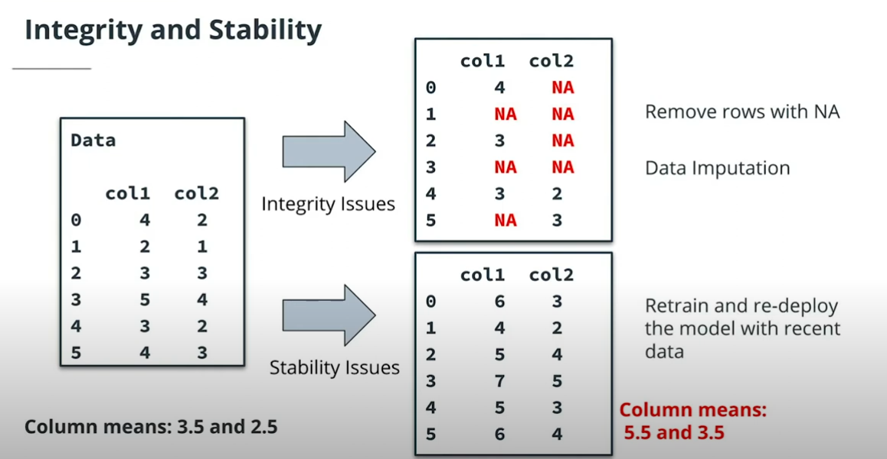
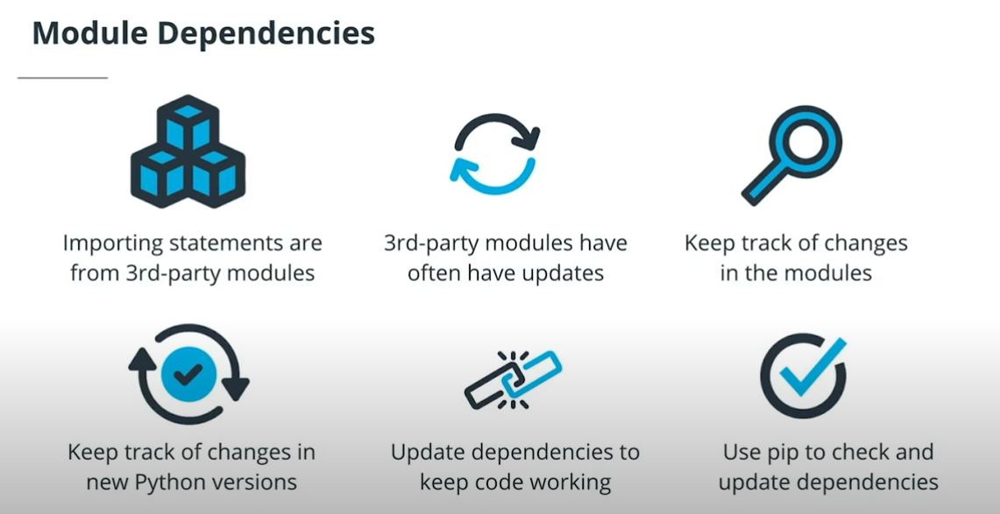

# Diagnosing and Fixing Operational Problems


Welcome to our lesson about diagnosing and fixing operational problems. Learning to diagnose and fix problems is very important in every ML project, since operational issues are nearly inevitable and they can derail even the best projects.

In this project, we'll discuss all of the following topics:

- **Process timing**: how to measure the timing of your project's ML processes
- **Integrity and stability**: how to diagnose integrity and stability issues in data
- **Dependencies**: understanding the third-party modules your code depends on
- **Data imputation**: an important method for resolving data integrity issues

By learning all of this, you'll gain important skills that will help you manage your ML projects and ensure they succeed.

---

In the diagram below, you can see an example machine learning project. However, pay special attention to the colored text, which indicates some potential operational problems that might happen to your project, and the consequences of those problems:


A diagram of a hypothetical ML project, with potential problems and consequences highighted

The following are operational issues that we'll discuss in this lesson:

- **Missing data**: when you ingest new data, you may find that some entries are missing. Missing data can cause your model to make inaccurate predictions.
- **Unstable data**: you may find that the data is not stable, that its values and means have changed substantially. Unstable data can also lead to inaccurate predictions.
- **Timing problems**: some parts of your project may suddenly have delays and timing problems. This can cause your predictions to arrive late or not arrive at all.
- **Dependency issues**: some modules that your code depends on may be outdated or buggy. This can cause your model to make inaccurate or useless predictions.

All of these problems are serious, and it's important to understand them and be able to diagnose and fix them.

## Timing ML Processes

Timing a process in Python follows the same logic as timing a process in the real world:

- Start a timer or stopwatch.
- At the moment when the timer starts, or as soon as possible afterward, begin the process you want to time.
- The process that you're timing ends.
- At the moment when the process ends, or as soon as possible afterward, stop the timer or stopwatch.

We can use the `timeit` module to check process timings in Python. We import it just like any other module:

```import timeit```

We can use the default_timer() as our "stopwatch":

`starttime = timeit.default_timer()`

Then, we run a process in Python:

`#[code for any process you want to time]`

Finally, we stop our "stopwatch," and calculate the difference between the starting time and the ending time:

`timing=timeit.default_timer() - starttime`

### Demo: Timing ML Processes

We start the demo by creating a file called `addnumbers.py`. This file contains a simple script. The purpose of this script is to add all the numbers between 1 and 10000. We don't care much what the final sum is - we're only using this script because we want to time how long it takes.

```python
##instantiating a variable that will store your final answer
finalanswer=0

##create a loop that iterates over all the numbers we're interested in, 
##and adds each of them to the final answer
for i in range(10000):
    finalanswer=finalanswer+i

##you can print the final answer
print(finalanswer)
```

Next, you can create a file called `timingdemo.py`. This file will time how long it takes to run `addnumbers.py`.

You can start your `timingdemo.py` file by importing the needed modules:

```python
import timeit
import os
```

Then, you need to start your timer or "stopwatch":

```python
starttime = timeit.default_timer()
```

Immediately after starting your stopwatch, you can run the addnumbers.py process:

```python
os.system('python3 addnumbers.py')
```

Immediately after running the process, you can stop the timer and calculate how long it took the process to run:

```python
timing=timeit.default_timer() - starttime
```

You can print the total time the process took:

```python
print(timing)
```

Finally, you can create a Python list that will contain your timing result:

```python
final_output=[]
```

Append the timing result to the list, and print out the final result:

```python
final_output.append(timing)
print(final_output)
```

## Integrity and Stability Issues

We always hope that our data will be perfect. Unfortunately, it's very common to encounter problems with the data in ML projects. There are two common data issues that we'll focus on here:

- **Data integrity**: when data is missing or invalid, we say that there's a data integrity issue.
- **Data stability**: when data contains values that are different from what we expect, we say there's a data stability issue.



You can chec

It's possible to resolve both data integrity and data stability issues:

- To resolve data integrity issues, you could simply remove all rows with NA values. This will ensure that your scripts run correctly. A more advanced solution is to perform data **imputation**: replacing NA values with educated guesses.
- To resolve data stability issues, the simplest solution is to retrain and redeploy your model using the new data. You may also consider increasing the frequency of retraining and redeployment.

The `pandas` module contains some capabilities that can be very helpful as you're checking for and resolving integrity and stability issues:

- The `mean()` method calculates the mean of rows or columns in `pandas` DataFrames.
- The `isna()` method checks whether entries in `pandas`DataFrames are NA values.
- The `sum()` method calculates the sum of numeric rows or columns in `pandas` DataFrames.
- The `.index` attribute gets the row numbers of `pandas` DataFrames.
- The `len()` method calculates the length of Python objects, including lists.

### Demo: Integrity and Stability Issues

You can start your demo by importing relevant modules:

```python
import ast import pandas as pd
```

Next, you can read a txt file that contains a list of historic means:

```python
with open('healthdata.txt', 'r') as f: 
    meanslist = ast.literal_eval(f.read())
```

Next, you can read a dataset, and calculate the means of its columns:

```python
thedata=pd.read_csv('bloodpressure.csv') 
themeans=list(thedata.mean())
```

Then, you can calculate the percent differences between the column means of the dataset and the historical means:

```python
meancomparison=[(themeans[i]-meanslist[i])/meanslist[i] for i in range(len(meanslist))]
print(meancomparison)
```

This accomplishes a check for data stability.

You can also count the number of NA entries in each column, as follows:

```python
nas=list(thedata.isna().sum()) 
print(nas)
```

## Module Dependencies

Most Python scripts import and depend on 3rd-party modules. Some of the modules that we've used often in this course are the following:

- **Pandas** (used for data manipulation)
- **NumPy** (used for scientific computation)
- **Scikit-learn** (also called sklearn, used for machine learning)




**Watch out!** If your scripts are using modules that are outdated, your code might stop working, or it might not work in the right way.

### Using pip

We can use the software tool called **pip** to install and work with Python dependencies. The following are some useful pip commands that you can run from your workspace's command line:

- `pip list` (return a list of all installed Python modules)
- `pip list --outdated` (show only the outdated modules)
- `pip freeze` (provides an output in “requirements format”)
- `pip show pandas`(provide specific information an installed module)
- `pip install pandas` (installs modules)
- `python -m pip list` (run pip through Python)


### Demo Summary

Start the demo by importing the subprocess module, which will enable you to run terminal commands from your Python script:

```python
import subprocess
```

Then, run the `pip check` command, and save the result to your workspace:

```python
broken=subprocess.check_output(['pip', 'check']) 
with open('broken.txt', 'wb') as f: 
    f.write(broken)
```

Next, run the `pip list --outdated` command, and save the result to your workspace:

```python
outdated = subprocess.check_output(['pip', 'list','--outdated']) 
with open('outdated.txt', 'wb') as f: 
    f.write(outdated)
```

Finally, run the `pip show` command to check the `numpy` module:

```python
numpyinfo=subprocess.check_output(['python','-m','pip', 'show', 'numpy']) 
with open('numpy.txt', 'wb') as f: 
    f.write(numpyinfo)
```
