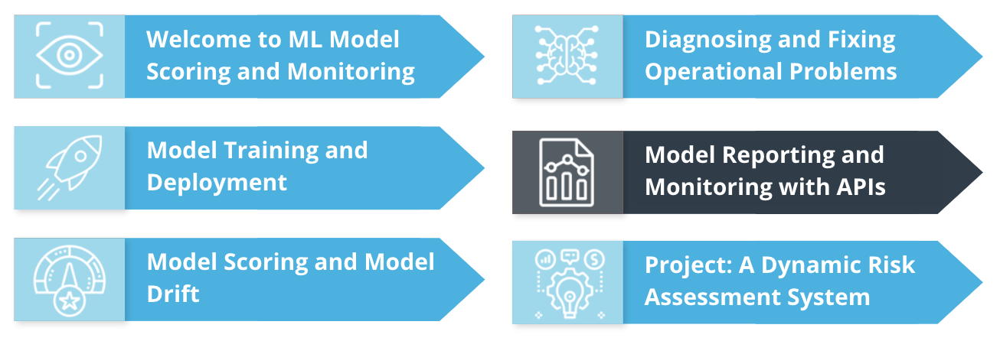
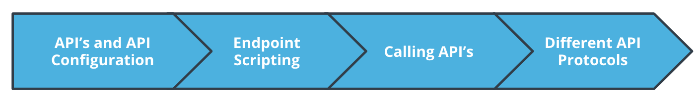
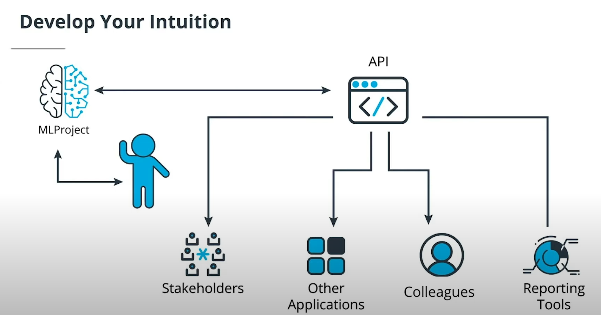

# Model Reporting and Monitoring with API's





ML projects often have many stakeholders and many people who need to know details related to data and model performance, and make sure the project performs as well as possible. Often, it's not feasible for all stakeholders to interact directly with the project to get the information they need. Instead, we need to set up reporting tools to give people easy access to useful information. One of the most versatile ways to set up project reporting is with an **API**.

In this lesson, we'll discuss model reporting and monitoring with API's. We'll cover all of the following topics:

- **API configuration**: how to configure simple API's
- **Endpoint scripting**: how to create endpoint functions that provide meaningful information to API users
- **Calling API'**s: how to call API's from Python scripts and the command line
- **Different API protocols**: information about other ways to set up advanced API capabilities

Setting up APIs for your project is very valuable because it enables quick, accurate reporting with minimal manual effort and monitoring of potential operational issues.

### Comparison of Flask, Django, and FastAPI

When it comes to web development frameworks in Python, Flask, Django, and FastAPI stand out as popular choices, each with its own set of advantages, disadvantages, and ideal use cases.

#### Advantages

**Flask**: Flask is known for its simplicity and flexibility, making it an excellent choice for small to medium-sized projects or when you need to quickly prototype an application. Its lightweight nature allows developers to have more control over the components they use, enabling greater customization. Additionally, Flask's extensive documentation and large community make it easy for developers to find support and resources.

**Django**: Django, on the other hand, is a high-level framework that follows the "batteries-included" philosophy, providing developers with a wide range of built-in features for rapid development. Its robustness makes it suitable for large-scale applications with complex requirements, such as content management systems, e-commerce platforms, and social networks. Django's built-in security features, admin interface, and ORM (Object-Relational Mapping) simplify the development process and promote best practices.

**FastAPI**: FastAPI shines in its performance and support for asynchronous programming. Leveraging Python's type hints, FastAPI offers automatic data validation and serialization, reducing the potential for errors and improving productivity. Its built-in support for OpenAPI and JSON Schema makes it ideal for developing APIs with comprehensive documentation. FastAPI's speed, combined with its simplicity and support for modern Python features, makes it a compelling choice for building high-performance APIs.

#### Disadvantages

**Flask**: While Flask's minimalistic approach offers flexibility, it may require more manual configuration and setup compared to other frameworks. For large-scale applications, developers might find themselves integrating multiple third-party extensions, which could lead to compatibility issues or dependencies on external maintainers.

**Django**: Despite its comprehensive feature set, Django's monolithic structure might not be suitable for every project. Developers working on smaller applications may find its conventions restrictive, and the framework's learning curve can be steep for beginners. Additionally, Django's ORM abstraction, while powerful, may introduce performance overhead for certain types of queries or operations.

**FastAPI**: While FastAPI excels in performance and modern features, its ecosystem is still evolving, which might result in a smaller community and fewer available resources compared to more established frameworks like Flask and Django. Additionally, the asynchronous programming paradigm might introduce complexity for developers who are not familiar with asynchronous concepts or who are working on projects that don't benefit significantly from async functionality.

#### Use Cases

**Flask**: Flask is well-suited for lightweight applications, RESTful APIs, and microservices where simplicity and customization are paramount. It's an excellent choice for projects that require rapid development or where specific libraries or components need to be integrated seamlessly.

**Django**: Django is ideal for large-scale web applications with complex business logic, such as social networks, content management systems, or e-commerce platforms. Its built-in admin interface, robust security features, and extensive ecosystem of third-party packages make it a solid choice for projects that demand scalability, maintainability, and security.

**FastAPI**: FastAPI shines in scenarios where performance and scalability are critical, such as building high-throughput APIs or microservices. Its support for asynchronous programming makes it suitable for applications with heavy I/O operations, real-time data processing, or streaming services. FastAPI's automatic validation and documentation features make it particularly well-suited for projects where API contracts need to be well-defined and maintained.

## Developing Your Intuition

When you work on ML projects, you become very familiar with them, and you learn how to get any information you need from them at any time.

Your colleagues may not have this same level of familiarity, and they may come to you with requests that you give them some information about the data, the models, or the project. When projects are big and important and get many requests, it will become infeasible for you to provide information and reports to everyone who makes a request.

This is why API's are so useful. API's provide an automated interface between projects and whoever needs to interact with projects. They can provide information to stakeholders, other applications, colleagues, and other reporting tools.

API's can also work in two directions: they can receive as well as give information when appropriate. By setting up API's, you enable a higher volume of quick, accurate reporting about your project. In turn, this ensures that your project is monitored regularly and any operational issues are noticed, diagnosed, and resolved quickly.



## Configuring APIs

In order to configure an API, you need to create a Python script. It's common to call this script `app.py`. These are the things you need to accomplish in your app.py script:

- import needed capabilities from the `flask` module.
- instantiate the app using the `Flask()` command.
- specify an endpoint for users to interact with.
- run the app using the `run()` method, specifying a host and a port.

You can configure an app.py script as follows:

First, import capabilities from the `flask` module:

```python
from flask import Flask, request
```

Then, instantiate the app:

```python
app = Flask(__name__)
```

Then, specify an endpoint with its own function:

```python
@app.route('/') 
def index(): number = request.args.get('number') 
return str(int(number)+1)+'\n'
```

Finally, run the app, specifying both a host and a port:

```python
app.run(host='0.0.0.0', port=8000)
```

To run the app, you can run `python3 app.py` from the command line.


## Endpoint Scripting

So far in this lesson, we've worked with very simple **API endpoints**. You should remember the endpoint we created in the solution to the previous exercise:

```python
@app.route('/') 
def index(): 
    user = request.args.get('user') 
    return "Hello " + user
```

This endpoint contains a route (`'/'`) and a simple Python function. These are required ingredients in every API endpoint.

API's with one simple endpoint can be useful. But it's often even more useful to have multiple, complex endpoints in an API. There's no limit to the number of endpoints an API can have, or what they can do. This part of the lesson is about how to create API's with multiple, complex endpoints, so they can be as useful as possible for your ML projects.


### Demo


Start by reading relevant modules:

```python
from flask import Flask, request 
import pandas as pd
```

Then, instantiate your app with the Flask() command:

```python
app = Flask(__name__)
```

Create a function that will read and return files. We can call this function an auxiliary function, or in other words, a helper function:

```python
def readpandas(filename): 
    thedata=pd.read_csv(filename) 
    return thedata
```

Specify our first endpoint, with a default route:

```python
@app.route('/') 
def index(): 
    user = request.args.get('user') 
    return str(user=='Bradford') + '\n'
```

Now, the most important part: specify another endpoint, with a different route, that accomplishes another, more complex task:

```python
@app.route('/medians')
def summary(): 
    filename = request.args.get('filename') 
    thedata=readpandas(filename) 
    return str(thedata.median(axis=0))
```

Notice that every endpoint has its own, unique function with its own, unique return statement.

Finally, run the app, specifying a hostname and a port:

```python
app.run(host='0.0.0.0', port=8000)
```


