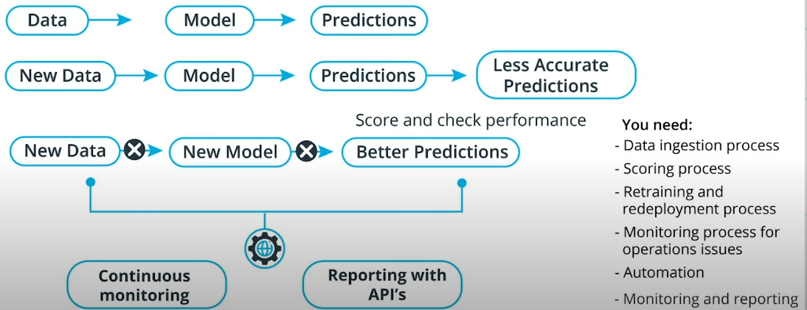
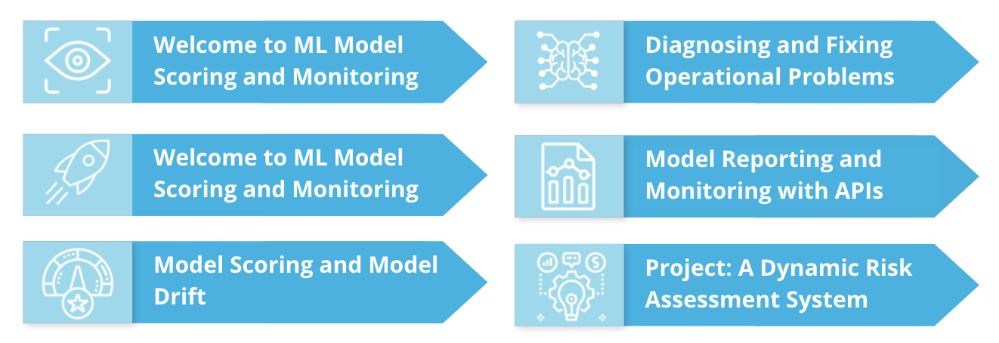
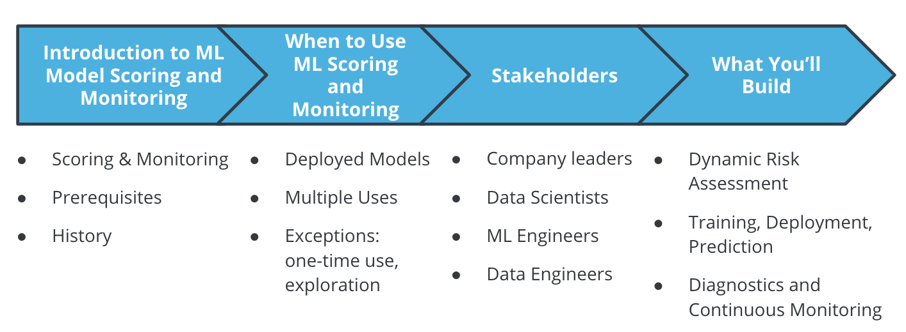
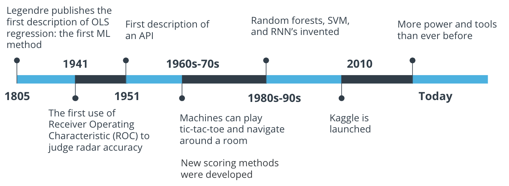
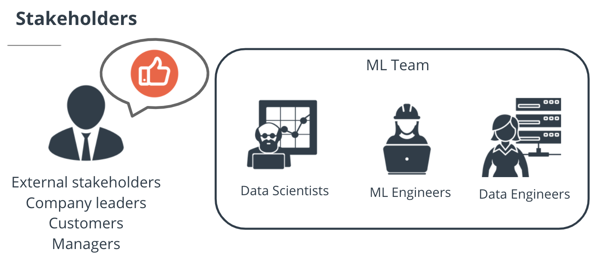
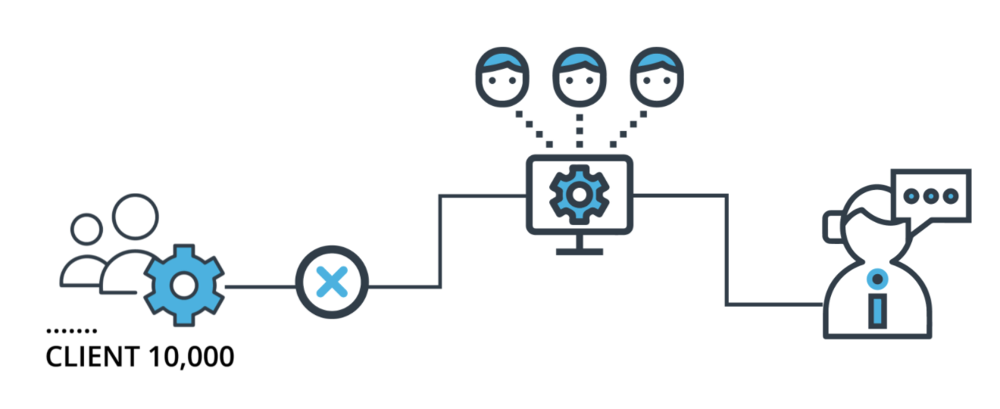
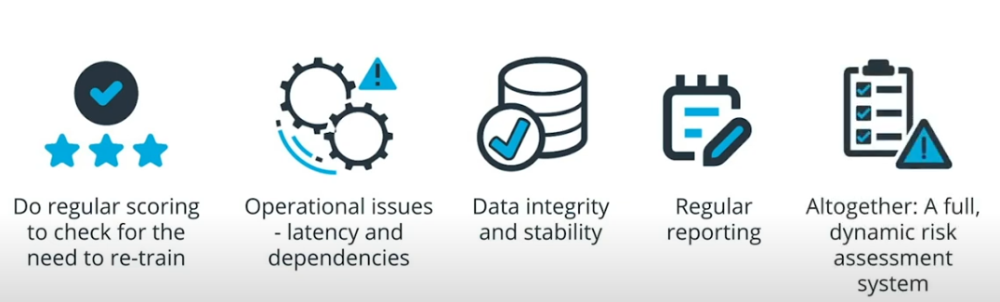
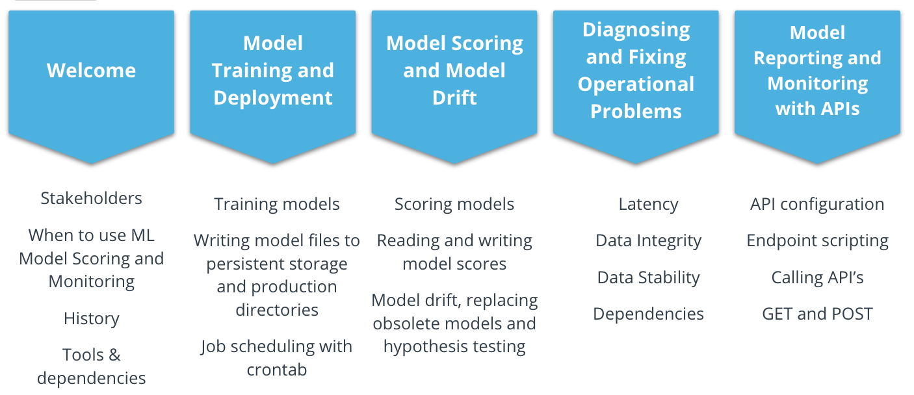

# ML Model Scoring and Monitoring

You already know how to create and train machine learning models. This course is about everything that happens after you create and deploy an ML model. Deploying a trained ML model is only the beginning of what needs to be a continuous process of re-training, scoring, and monitoring. Your work as a data scientist hasn't ended just because you've deployed an ML model.

One step you need to take after deploying your model is **data ingestion**. You'll need to ingest new data in order to make predictions and also to evaluate the performance of your model.

If your model's performance has gotten worse, you'll need to **re-train and re-deploy** your model. This lesson will also cover those processes.

You may encounter operational issues with your models. If so, you'll have to perform **diagnostics and monitoring** to check what problems exist and how to solve them.

You should also learn to **automate** all of these processes, to reduce manual intervention and improve accuracy.

In short, ML Model Scoring and Monitoring is an important, continuous process that takes place after the creation and deployment of an ML model.

## Course Outline

### Lesson 1:

In this lesson, we'll cover model training and deployment, including the following:

- data ingestion
- process record-keeping
- automating ML processes
- retraining and re-deploying ML models
  You'll be able to ingest data and retrain and re-deploy models by the end of this lesson.

### Lesson 2:

This lesson will cover the idea of model scoring and model drift, including the following:

- automatically scoring ML models
- recording model scores
- checking for model drift
- hypothesis testing in model comparisons
  After this lesson, you'll be able to check whether models need to be retrained and re-deployed.

### Lesson 3:

This lesson will cover diagnosing and fixing operational problems, including the following:

- timing processes and checking for latency issues
- checking for and resolving module dependency issues
- checking for and resolving data stability issues
  After this lesson, you'll be able to diagnose and resolve any operational issues that may come up in your projects.

### Lesson 4:

This lesson will cover model scoring and monitoring with API's, including the following:

- configuring API's on your workspace
- scripting endpoints to improve your API's
- running and calling API's
  After this lesson, you'll be able to continuously monitor your ML projects using API's.

## History of ML Model Scoring and Monitoring

Machine learning model scoring and monitoring are at least as old as ordinary least squares regression, the oldest machine learning method. That method was invented in 1805, many decades before computers or the internet.

In the 20th century, continuous advances in computing power and statistical theory have given us many more machine learning methods, and many scoring and monitoring methods. The Receiver Operating Characteristic, an important scoring method, was invented during World War II. The first description of an API came in 1951, and an important monitoring method was born.

In recent decades, machine learning has become something that's done all over the world by researchers and companies in every industry. In 2010, Kaggle was launched, providing a forum for high-stakes ML competitions and data sharing. We're lucky to have more power, more methods, more data, and more opportunities than ever before.

## When To Use ML Model Scoring and Monitoring

You should use the methods and ideas of ML Model Scoring and Monitoring in almost every ML project you ever work on. The following are times when you'll want to use ML Model Scoring and Monitoring:

- When you've deployed an ML model to a production environment
- When your model will be used multiple times or at regular intervals
- When you want your ML project to succeed!

There are some exceptions when you won't need to use the ideas in this course. They include:

- If your project doesn't use an ML model
- If you're just exploring or experimenting
- If your ML model only needs to be used one time
- If you're working on ML theory rather than an applied model

## Stakeholders

It's important to know who you'll be working with on your ML projects, and how you'll interact with them. In a typical ML Model Scoring and Monitoring project, you'll work with the following stakeholders:

- **External stakeholders**, including company leaders and customers. These people won't be involved in the day-to-day details of your project, they'll only want to feel sure that the project is working well and delivering accurate predictions.
- **Data scientists** work closely with data and models, doing training and tuning to make sure predictions are as accurate as possible.
- **ML Engineers** work with ML models, including improving their accuracy and optimizing their performance. They'll be more involved than data scientists in operational aspects of projects.
- **Data Engineers** work closely with data. They may work with database administration, data ingestion, and feature engineering.

## Project: A Dynamic Risk Assessment System

At the end of this course, you'll build a machine learning project that will incorporate all the topics of the course. You can keep this project as part of your portfolio, and show it to future colleagues and employers.

In the project, you'll build a dynamic risk assessment system. Imagine that you work for a company that has thousands of corporate clients. Your company wants to keep all of its clients, but for every client, there's a risk that the client will exit their contract, causing you to lose money. Your task will be to use historical information about clients to make predictions about each client's risk of exiting their contract, or in other words, their attrition risk.

By predicting the attrition risk of each of your company's clients, you can help your company avoid losing clients. This kind of risk assessment is something that every company wants to be able to do well.

In addition to setting up the machine learning model for this project, you'll set up the operational aspects of the project, including the following:

- automated data ingestion
- checking for model drift
- retraining and re-deployment
- diagnosis of operational issues
- continuous monitoring with API's

# Course Recap

This course has been about ML Model Scoring and Monitoring. We covered all of the following topics:

- The idea of ML Model Scoring and Monitoring
- Automated model training and deployment, including how to automate ML processes, and how to train models and deploy them to persistent storage
- Model scoring and model drift, including the idea of model drift, the need to continually check model scores, how to test for model drift, and what to do when model drift is detected
- Diagnosing and fixing operational issues, including how to check for and resolve operational problems like timing slowdowns, data integrity and stability issues, and broken dependencies
- Model reporting and monitoring with API's, including how to set up and call API's, and how to use them to check for important information about your ML project

