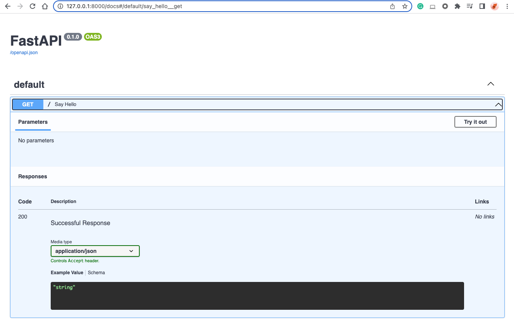
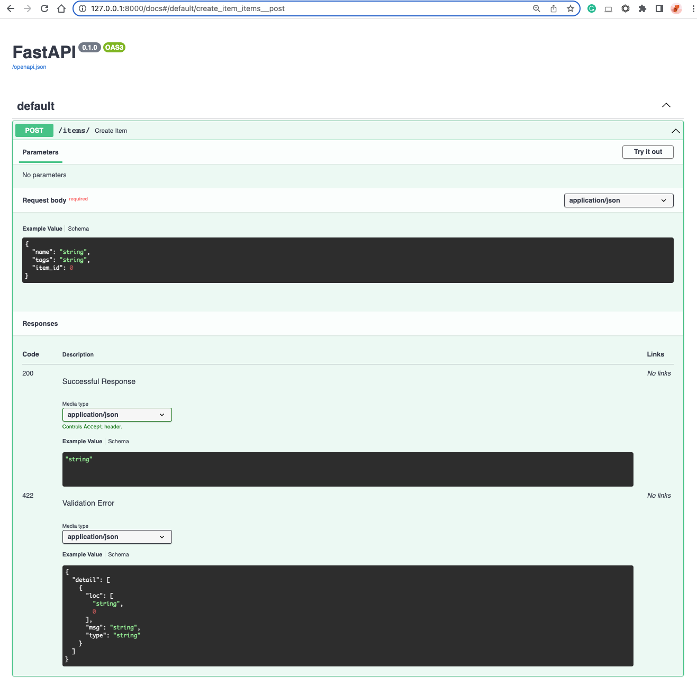
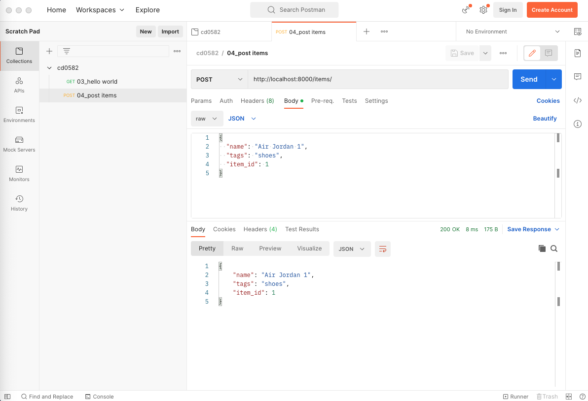
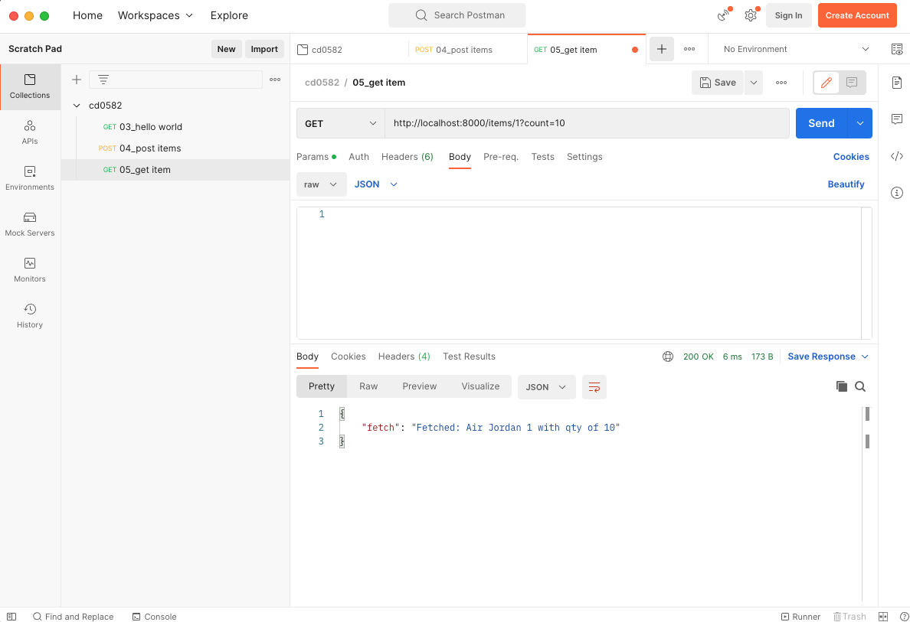

# API Deployment with FastAPI

In this lesson, we will give an overview of Python-type hints. With these in hand, we will delve into FastAPI which leverages type hints to build a robust and self-documenting REST API. We will first build out our API locally, test it, and then deploy it to Heroku and again test it once live.

- Review of Python Type Hints
- Fundamentals of FastAPI
- Local API Testing
- Heroku Revisited
- Live API Testing

## Python Type Hints Overview

Python is a dynamically typed language, which means the variable's type is checked at run-time as opposed to statically typed where the variable type is declared in the code, e.g. `int a`.

Python's type hinting system nudges Python towards static typing, but as the name states, these are merely type hints and not type declarations. This means that Python itself does not enforce type checking. Instead, the type hints enable additional functionality in the Python ecosystem such as static type checking in an IDE or modules that depend on type hints.

An example of a Python type hint:

```python
from typing import Union

def foo(a: Union[list,str], b: int = 5) -> str:
    pass
```

This declares a function that takes in two arguments: one that is required and one that is optional. The first one expects either a list or a string, the second expects an int. Finally, the function is expected to return a string. As shown, you can import various types of primitives from the `typing` module.

#### Further Reading

[PEP 483](https://peps.python.org/pep-0483/) on The Theory of Type Hints

The [docs](https://docs.python.org/3/library/typing.html) for the Python `typing` module.

## Introduction to FastAPI

FastAPI is a modern API framework that relies heavily on type hints for its capabilities.

As the name suggests, FastAPI is designed to be fast in execution and development. It is built for maximum flexibility in that it is solely an API. You are not tied into particular backends, frontends, etc., thus enabling composability with your favorite packages and existing infrastructure.

### Install FastAPI in a Virtual Environment
We will use VENV virtual environment to install FastAPI by its parts, which are: (i) the core FastAPI library and (ii) uvicorn to run the FastAPI server.

1. Create a VENV environment in the App folder and activate
```
python -m venv venv
source venv/bin/activate
```

2. Install FastAPI an Uvicorn libraries
```
pip install fastapi
pip install "uvicorn[standard]"
```

### Getting Started
To start using the FastAPI library to build a simple API app, you can create a blank "main.py" file in your App folder and add the "hello world" script below in the main.py file:

```
from fastapi import FastAPI

# Instantiate the app.
app = FastAPI()

# Define a GET on the specified endpoint.
@app.get("/")
async def say_hello():
    return {"greeting": "Hello World!"}
```

GitHub repo: [https://github.com/udacity/cd0582-api-deployment-with-fastapi/tree/3-hello-world](https://github.com/udacity/cd0582-api-deployment-with-fastapi/tree/3-hello-world)

To run our app, we will use uvicorn in our shell: `uvicorn main:app --reload`.

The `--reload` allows you to make changes to your code and have them instantly deployed without restarting uvicorn.
By default, our app will be available locally at http://127.0.0.1:8000. The output of the above snippet will return a JSON response as `{"greeting": "Hello World!"}` on the browser `(URL http://127.0.0.1:8000)`.

### API Docs Generation
FastAPI will automatically generate API interactive documents from your codes. To access the API docs, go to `http://127.0.0.1:8000/docs`.



#### Further Reading
The FastAPI [docs](https://fastapi.tiangolo.com/) are excellently written, check them out!

## Core Features of FastAPI

FastAPI's type checking uses a mix of standard Python's type hints in function definitions and the package Pydantic.

Note: you should be able to import Pydantic as this package is part of FastAPI installation. However, if your environment can't find this package, you can run pip install pydantic from your terminal.

Pydantic defines data models which define the types that are expected in a request body, like the following example:
```
# Import Union since our Item object will have tags that can be strings or a list.
from typing import Union 

from fastapi import FastAPI
# BaseModel from Pydantic is used to define data objects.
from pydantic import BaseModel

# Declare the data object with its components and their type.
class TaggedItem(BaseModel):
    name: str
    tags: Union[str, list] 
    item_id: int

app = FastAPI()

# This allows sending of data (our TaggedItem) via POST to the API.
@app.post("/items/")
async def create_item(item: TaggedItem):
    return item
```

This little bit of code unlocks many features such as converting the body to JSON, converting and validating types as necessary, and generating automatic documentation (which we can visit by going to 127.0.0.1:8000/docs or the equivalent URL when live).



As you can see from the API doc, the request body requires three attributes, ie. name, tags, and item_id. You can test your API by clicking Try it out! button, enter the request body in json format, and click Execute button.

The request body is determined by the Pydantic data model as defined in the code above.

```
class TaggedItem(BaseModel):
    name: str
    tags: Union[str, list]
    item_id: int
```

### Testing POST API using Postman
When we develop an API-only app, it is common to use Postman. Developers use this tool to design, build, test, and iterate their APIs. You can download the Postman desktop app from this website: https://www.postman.com/

As you can see in the screenshot below, you will need to select `POST` method, enter the endpoint http://localhost:8000/items, and define the `request body` in JSON according to the Tagged Items model schema.

When you click `Send` button, the server will return `200 OK` confirmation and the response body in JSON format.

Codes and Postman collection for this exercise: https://github.com/udacity/cd0582-api-deployment-with-fastapi/tree/4-post-items




Now we will build on that and with path and query parameters:

```
## A GET that in this case just returns the item_id we pass, 
## but a future iteration may link the item_id here to the one we defined in our TaggedItem.
@app.get("/items/{item_id}")
async def get_items(item_id: int, count: int = 1):
    return {"fetch": f"Fetched {count} of {item_id}"}

## Note, parameters not declared in the path are automatically query parameters.
```

GitHub repo: https://github.com/udacity/cd0582-api-deployment-with-fastapi/tree/5-get-item

Path and query parameters are naturally strings since they are part of the endpoint URL. However, the type hints automatically convert the variables to their specified type. FastAPI automatically understands the distinction between path and query parameters by parsing the declaration. Note, to create optional query parameters use `Optional` from the `typing` module.

If we wanted to query the above API running on our local machine it would be via `http://127.0.0.1:8000/items/42/?count=1`.



### Demo

The first file, `main.py`, contains the definition of the API. There are two methods, a post and a get.

The post takes a JSON object with the format defined by the `pydantic` model `TaggedItem`. In this case, this item is some object with a `name`, one or more `tags` in the form of strings, and an integeter `item_id`.

The get method is used to retrieve `count` instances of `item_id`. This example is just a stub, but one can imagine the post method populating a database with various items and then the get method would be used to retrieve items from the database.

To run this we use the command `uvicorn main:app --reload`. This launches a local server which we use to interact with our API.

In `sample_request.py` we see part of that functionality at work. A post request is made to the local host where our API is running. This post reqest contains a JSON object which is a Hitchhking Kit that has the tags of book and towel, and, surprising to fans of Douglas Adams, it has an `item_id` of 23. To send this post request to our running server use `python sample_request.py` while the server is running.


