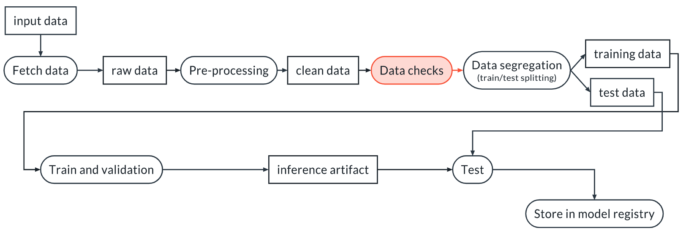

## Why You Need Data Validation 

We perform data validation in order to verify that our assumptions about the data are correct and stay correct even for new datasets. This latter point is not guaranteed. Indeed, the data can change for many reasons:

- Bugs are introduced upstream (for example in ETL pipelines)
- Changes in the source of the data are not communicated properly and produce unexpected changes in the input data
- The world changes and the distribution of the input data changes





## Fixture

In many cases tests need input data. This data can be provided using fixtures. Fixtures are special functions introduced by pytest. They must have the same name of the variable in the input of the test that they are supposed to fill. For example:

```python
import pytest
import wandb

run = wandb.init()

@pytest.fixture(scope="session")
def data():

    local_path = run.use_artifact("my_project/artifact").file()
    df = pd.read_csv(local_path, low_memory=False)

    return df


def test_data_length(data):
    """
    We test that we have enough data to continue
    """
    assert len(data) > 1000
```

## Running the tests
If the tests are within the tests directory, we can run all the tests below. The -vv option means verbose, and it yields a more pleasant visualization of the results.

```sh
> pytest tests/ -vv
```

## Deterministic Tests

A data test is deterministic when it verifies attributes of the data that can be measured without uncertainty. Some examples are:

- Number of columns in a dataset
- Length of the dataset
- Distinct values in a categorical variable
- Legal range for a numerical variable (for example, length > 0)

## Non-deterministic (Statistical) Tests

A test is non-deterministic when it involves measuring a quantity with intrinsic uncertainty (a random variable). For this reason, it involves Statistical Hypothesis Testing.

Most non-deterministic tests compare the present dataset with a previous one that is used as a reference.

Some examples of non-deterministic tests are:

- Check the mean and/or standard deviation of columns
- Check the level of correlations between columns, or a column and the target
- Check the distribution of values within one or more columns
- Check for outliers

## Hypothesis testing
We are going to consider Frequentist Hypothesis Testing. In this statistical framework we have a null hypothesis and an alternative hypothesis. In our case, the null hypothesis represents our assumption about the data, while the alternative represents a violation of that assumption. For example, the null hypothesis could be "the two samples come from populations with a Normal distribution and equal means", and the alternative hypothesis could be "the two samples come from populations with a Normal distribution but different means":

```python
import scipy.stats

def test_compatible_mean(sample1, sample2):
    """
    We check if the mean of the two samples is not
    significantly different
    """
    ts, p_value = scipy.stats.ttest_ind(
        sample1, sample2, equal_var=False, alternative="two-sided"
    )

    # Pre-determined threshold
    alpha = 0.05

    assert p_value >= alpha, "T-test rejected the null hyp. at the 2 sigma level"

    return ts, p_value
```

The function from scipy returns the p-value of the test, in this case the t-test. We just need to assert that such p-value is larger than the pre-determined threshold, so that the tests fails if that's not the case.

## Parameters in Pytest

We can introduce parameters to the pytest command line by using the conftest.py file.

In this file we can add a special function called `pytest_addoption` and use a special fixture made available by `pytest`, called `parser`, like this:

```python
def pytest_addoption(parser):
    parser.addoption("--input_artifact", action="store")
```

The .addoption method of the parser object adds an option that is going to be available on the command line. By having this code in conftest.py we can now run pytest as:

```sh
> pytest . -vv --input_artifact example/my_artifact:latest
``


