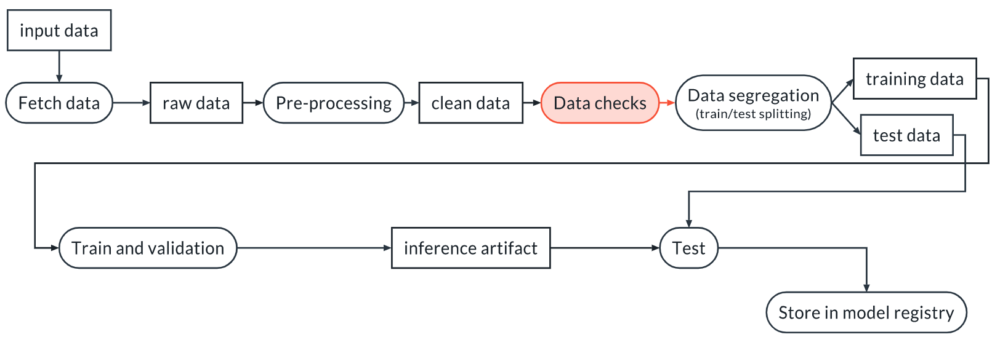

## Why You Need Data Validation 

We perform data validation in order to verify that our assumptions about the data are correct and stay correct even for new datasets. This latter point is not guaranteed. Indeed, the data can change for many reasons:

- Bugs are introduced upstream (for example in ETL pipelines)
- Changes in the source of the data are not communicated properly and produce unexpected changes in the input data
- The world changes and the distribution of the input data changes





## Fixture

In many cases tests need input data. This data can be provided using fixtures. Fixtures are special functions introduced by pytest. They must have the same name of the variable in the input of the test that they are supposed to fill. For example:

```python
import pytest
import wandb

run = wandb.init()

@pytest.fixture(scope="session")
def data():

    local_path = run.use_artifact("my_project/artifact").file()
    df = pd.read_csv(local_path, low_memory=False)

    return df


def test_data_length(data):
    """
    We test that we have enough data to continue
    """
    assert len(data) > 1000
```

## Running the tests
If the tests are within the tests directory, we can run all the tests below. The -vv option means verbose, and it yields a more pleasant visualization of the results.

```bash
pytest tests/ -vv
```

## Deterministic Tests

A data test is deterministic when it verifies attributes of the data that can be measured without uncertainty. Some examples are:

- Number of columns in a dataset
- Length of the dataset
- Distinct values in a categorical variable
- Legal range for a numerical variable (for example, length > 0)


