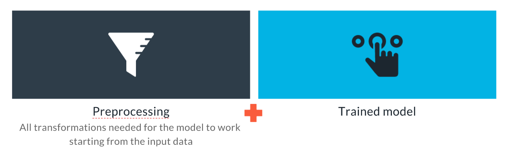
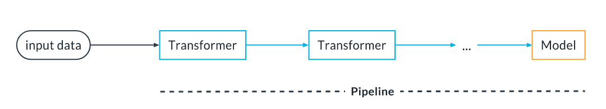
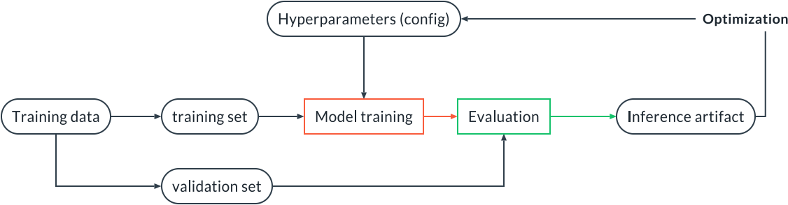

# Training, Validation and Experiment Tracking

## The Inference Pipeline

An inference pipeline is an ML pipeline that contains everything that needs to run in production at inference time: a pre-processing step that transforms the data input to the data expected by the model, and then the model.

An inference artifact is a serialized (i.e., saved to disk) static version of the inference pipeline containing the preprocessing as well as a trained model.

Using an inference pipeline and an inference artifact helps us achieve development/production symmetry because the code that executes the preprocessing during training is the same code that does the preprocessing in production.

So, summarizing, this is what an inference artifact looks like:



## Write a Training/Inference Sub-Pipeline



It is a sequence of Transformers, which receive the input and transform it in some way, followed by a model that receives the transformed input and returns an output (a classification or a regression prediction). The term transformers here has nothing to do with the transformers widely used in NLP modeling. Instead, transformers are objects that transform the input data, for example by encoding categorical features or renormalizing numerical features.

The pipeline can be fitted in one go. Suppose we have a pipeline with two transformers, transformer A and transformer B, and then a model C. Sklearn will fit A, then use A to transform the input training data and use the result to train B. Then the data will be transformed by B and finally fed to the model C for training.

The pipeline can also be deployed as a whole. At inference time, the input data will go through A, then the result will go through B, and finally through C to get the final inference.

Let's see how to implement such a pipeline with sklearn. Let's assume transformer A is an imputer (to impute missing values), transformer B is a scaler and the model C is a Logistic Regression model:

It is a sequence of Transformers, which receive the input and transform it in some way, followed by a model that receives the transformed input and returns an output (a classification or a regression prediction). The term transformers here has nothing to do with the transformers widely used in NLP modeling. Instead, transformers are objects that transform the input data, for example by encoding categorical features or renormalizing numerical features.

The pipeline can be fitted in one go. Suppose we have a pipeline with two transformers, transformer A and transformer B, and then a model C. Sklearn will fit A, then use A to transform the input training data and use the result to train B. Then the data will be transformed by B and finally fed to the model C for training.

The pipeline can also be deployed as a whole. At inference time, the input data will go through A, then the result will go through B, and finally through C to get the final inference.

Let's see how to implement such a pipeline with sklearn. Let's assume transformer A is an imputer (to impute missing values), transformer B is a scaler and the model C is a Logistic Regression model:

```python
from sklearn.preprocessing import StandardScaler
from sklearn.impute import SimpleImputer
from sklearn.linear_model import LogisticRegression
from sklearn.pipeline import Pipeline, make_pipeline

pipe = Pipeline(
  steps=[
    ("imputer", SimpleImputer()),
    ("scaler", StandardScaler()),
    ("model", LogisticRegression())
  ]
)

# OR
pipe = make_pipeline(SimpleImputer(), StandardScaler(), LogisticRegression())
```

Now the pipeline can be fit at once with:

```python
pipe.fit(X_train, y_train)
```

and used for inference:

```python
pipe.predict(X_test)
pipe.predict_proba(X_test)
```

A pipeline can be a lot more complex than this, of course.

Sometimes we want to apply a different preprocessing to groups of columns in a dataframe. For that we can use the ColumnTransformer class in sklearn:


Two demonstrations are presented:

1. ColumnTransformer in `demo/sklearn_pipeline/`
2. Inference Pipeline with PyTorch in `demo/pytorch/`

## Machine Learning Experimentation

**Version our data, Version our code, Track every experiment**. 
With these 3 key steps in place, we can perform experimentation following this process:



## Export Your Model Sub-Pipeline

Exporting means packaging our inference pipeline into a format that can be saved to disk and reused by downstream tasks, for example our production environment.

We can export our inference pipeline/model using mlflow. MLflow provides a standard format for model exports that is accepted by many downstream tools. Each export can contain multiple flavors for the same model. A flavor is a particular subformat for the model. A downstream tools could support some flavors but not others. Of course, the exported artifact can also be re-read by mlflow. Finally, the export contains also all the information to recreate the environment for the model with all the right versions of all the dependencies.

MLflow provides several flavors(opens in a new tab) out of the box, and can natively export models from sklearn, pytorch, Keras, ONNX and also a generic python function flavor that can be used for custom things.

When generating the model export we can provide two optional but important elements:

1. A signature, which contains the input and output schema for the data. This allows downstream tools to catch obvious schema problems.
2. Some input examples: these are invaluable for testing that everything works in downstream task

Normally MLflow figures out automatically the environment that the model need to work appropriately. However, this environment can also be explicitly controlled(opens in a new tab). Finally, the exported model can be easily converted(opens in a new tab) to a Docker image that provides a REST API for the model.

```python
from sklearn.pipeline import Pipeline
import mlflow.sklearn
from mlflow.models import infer_signature

# Define and fit pipeline
pipe = Pipeline(...)
pipe.fit(X_train, y_train)
pred = pipe.predict(X_test)

signature = infer_signature(X_test, pred)

# Get signature and export inference artifact
export_path = "model_dir"

mlflow.sklearn.save_model(
  pipe,  # our pipeline
  export_path,  # Path to a directory for the produced package
  signature=signature, # input and output schema
  input_example=X_test.iloc[:5]  # the first few examples
)

artifact = wandb.Artifact(...)
# NOTE that we use .add_dir and not .add_file
# because the export directory contains several
# files
artifact.add_dir(export_path)
run.log_artifact(artifact)
```

## Test Your Final Artifact and Mark for Production

We evaluate the inference artifact against the test dataset after export, i.e., we load the exported inference artifact in a different component (the test component) and we evaluate its performances. 
We do this so we are testing exactly what will be used in production.

Thus, within the component evaluating the inference artifact we can do:

```python
model_export_path = run.use_artifact(args.model_export).download()

pipe = mlflow.sklearn.load_model(model_export_path)
```

to load the inference artifact. 
Note that the model export artifact (aka the inference artifact) contains several files, so we need the path to the directory containing the files. 
Therefore, we use `.download()` and not `file()` as we did so far.

Once we have reloaded our pipeline, we can test it as usual, for example computing the ROC metric:

```python
pred_proba = pipe.predict_proba(X_test)
score = roc_auc_score(y_test, pred_proba, average="macro", multi_class="ovo")
run.summary["AUC"] = score
```

