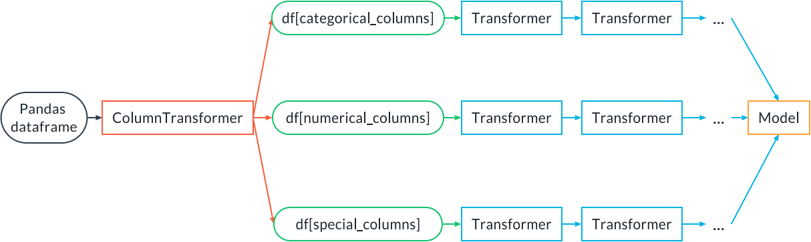

# Training, Validation and Experiment Tracking

## The Inference Pipeline

An inference pipeline is an ML pipeline that contains everything that needs to run in production at inference time: a pre-processing step that transforms the data input to the data expected by the model, and then the model.

An inference artifact is a serialized (i.e., saved to disk) static version of the inference pipeline containing the preprocessing as well as a trained model.

Using an inference pipeline and an inference artifact helps us achieve development/production symmetry because the code that executes the preprocessing during training is the same code that does the preprocessing in production.

So, summarizing, this is what an inference artifact looks like:


## Write a Training/Inference Sub-Pipeline


It is a sequence of Transformers, which receive the input and transform it in some way, followed by a model that receives the transformed input and returns an output (a classification or a regression prediction). The term transformers here has nothing to do with the transformers widely used in NLP modeling. Instead, transformers are objects that transform the input data, for example by encoding categorical features or renormalizing numerical features.

The pipeline can be fitted in one go. Suppose we have a pipeline with two transformers, transformer A and transformer B, and then a model C. Sklearn will fit A, then use A to transform the input training data and use the result to train B. Then the data will be transformed by B and finally fed to the model C for training.

The pipeline can also be deployed as a whole. At inference time, the input data will go through A, then the result will go through B, and finally through C to get the final inference.

Let's see how to implement such a pipeline with sklearn. Let's assume transformer A is an imputer (to impute missing values), transformer B is a scaler and the model C is a Logistic Regression model:

It is a sequence of Transformers, which receive the input and transform it in some way, followed by a model that receives the transformed input and returns an output (a classification or a regression prediction). The term transformers here has nothing to do with the transformers widely used in NLP modeling. Instead, transformers are objects that transform the input data, for example by encoding categorical features or renormalizing numerical features.

The pipeline can be fitted in one go. Suppose we have a pipeline with two transformers, transformer A and transformer B, and then a model C. Sklearn will fit A, then use A to transform the input training data and use the result to train B. Then the data will be transformed by B and finally fed to the model C for training.

The pipeline can also be deployed as a whole. At inference time, the input data will go through A, then the result will go through B, and finally through C to get the final inference.

Let's see how to implement such a pipeline with sklearn. Let's assume transformer A is an imputer (to impute missing values), transformer B is a scaler and the model C is a Logistic Regression model:

```python
from sklearn.preprocessing import StandardScaler
from sklearn.impute import SimpleImputer
from sklearn.linear_model import LogisticRegression
from sklearn.pipeline import Pipeline, make_pipeline

pipe = Pipeline(
  steps=[
    ("imputer", SimpleImputer()),
    ("scaler", StandardScaler()),
    ("model", LogisticRegression())
  ]
)

# OR
pipe = make_pipeline(SimpleImputer(), StandardScaler(), LogisticRegression())
```

Now the pipeline can be fit at once with:

```python
pipe.fit(X_train, y_train)
```

and used for inference:

```python
pipe.predict(X_test)
pipe.predict_proba(X_test)
```

A pipeline can be a lot more complex than this, of course.

Sometimes we want to apply a different preprocessing to groups of columns in a dataframe. For that we can use the ColumnTransformer class in sklearn:



Two demonstrations are presented:

1. ColumnTransformer in `demo/sklearn_pipeline/`
2. Inference Pipeline with PyTorch in `demo/pytorch/`


