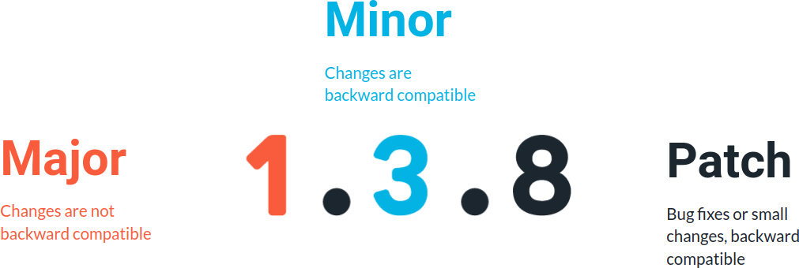
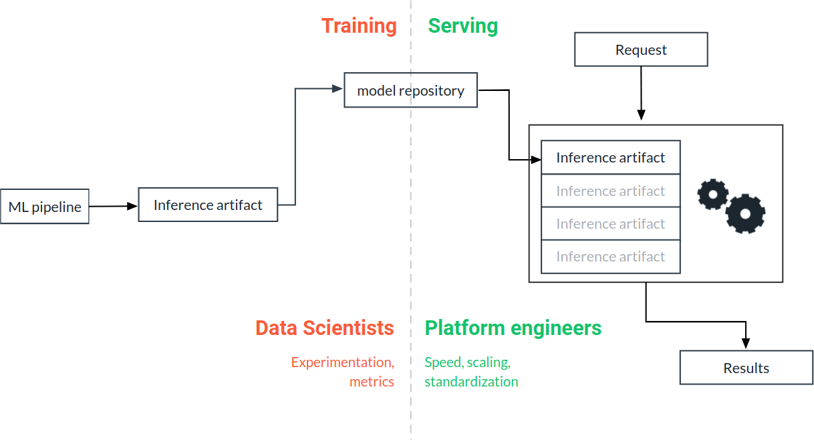

# Final Pipeline, Release and Deploy

## Release Basics

MLflow pipelines are code, and the code needs to be versioned. We have two options:

1. Collect all our pipeline, including the main script, its `conda.yml`, and its `MLproject` file as well as all the components with their `conda.yml`, their code and their `MLproject` files in the same repository. This is simple and good to start with.
2. Have separate repositories: one for the pipeline (the main script as well as the relative `conda.yml` and `MLProject`) and a separate one for the components. This promotes reusability and discoverability, because all the components of different pipelines are collected together in the same place where can be discovered, modified, released and versioned. This is what you need when you are scaling up and you have several ML pipelines. It is also a preliminary step for Level 2 MLops.

A release is a static copy of the code that reflects its state at a particular point in time. It has a version and a tag attached to it. The tag can be used to restore the repository (or a local copy of the code in the repository) to its state when the release is cut.

Semantic Versioning is a common schema for versioning release: a release is made of 3 numbers, like 1.3.8. The first number is called the major version. We only increment the major version when we make changes that break backward compatibility (i.e., a code running with the previous version is likely to break with the new version). The second number is called minor. We increment it when we make a significant change that is backward-compatible, i.e., code running with the previous version is not expected to break with the new one. And finally, we have a patch number. We increment it for bug fixes and small changes that do not significantly change the code's behavior (excluding the bugs fixed).



## Deploy with MLflow

This is a schematic representation of the workflow that brings a model to production:




The ML pipeline produces the inference artifact. The inference artifact is stored in the Model Repository, which for us is the Artifact tracking solution of W&B. On the serving side, a manual or an automatic process fetches the inference artifact from the model repository and deploys it to the production system, alongside the other models that have been already deployed. From now on, the production system receives requests and the response includes the newly-deployed model. The deployment step is the point of contact between the development world, typically the responsibility of data scientists, and the serving world, typically the responsibility of software and platform engineers. It is also an interface where the focus changes from experimentation and performance to standardization, speed and reliability. Most of the production problems not related to model performance happen at this interface.

There are two ways of using a model in production: Real-time and Batch.

Real-time (online)
Here, we are interested in providing answers one at the time, typically through an API. Most of the time the performance metric that matters here is latency, i.e., the time needed to process one entity (from request to answer). An example of a real-time inference application is providing movie recommendations on a website: we want to provide the answer as quickly as possible, so that the user is not left hanging waiting for the page to load.

Batch (offline)
Here, we are receiving several requests at once (a batch), and we want to process the entire batch in the shortest possible time. Therefore, our metric of reference here is throughput, i.e., the amount of requests per unit time that we can process. We are willing to sacrifice latency if that means that we can process more requests, in say, a second. For example, when we have a deep learning model on a GPU, we might wait until we accumulate a certain number of requests, and then send the entire batch to the GPU. Therefore, the latency for the first request that we receive will be pretty large because this request will hang until other requests are received.

## Use MLflow for serving models
Let's consider batch processing first. MLflow allows you to use any artifact exported with MLflow for batch processing.

For example, let's fetch an inference artifact from one of the previous exercises using wandb:

```sh
> wandb artifact get genre_classification_prod/model_export:prod --root model
```

The `--root` option sets the directory where wandb will save the artifact. 
So after this command we have our MLflow model in the model directory. 
We can now use it for batch processing by using mlflow models predict:

```sh
> mlflow models predict -t json -i model/input_example.json -m model
```

where `input.csv` is a file containing a batch of requests, `-t` indicates the format of the file (csv in this case), 
and `-m model` specifies the directory containing the model.

## Online Inference

We can serve a model for online inference by using mlflow models serve (we assume we already have our inference artifact in the model directory):

```sh
> mlflow models serve -m model &
```

Mlflow will create a REST API for us that we can interrogate by sending requests to the endpoint (which by default is http://localhost:5000/invocations). 
For example, we can do this from python like this:

```python
import requests
import json
   
with open("data_sample.json") as fp:
    data = json.load(fp)
   
results = requests.post("http://localhost:5000/invocations", json=data)
   
print(results.json())
```
